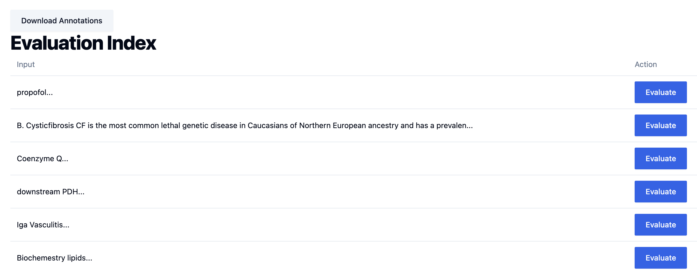
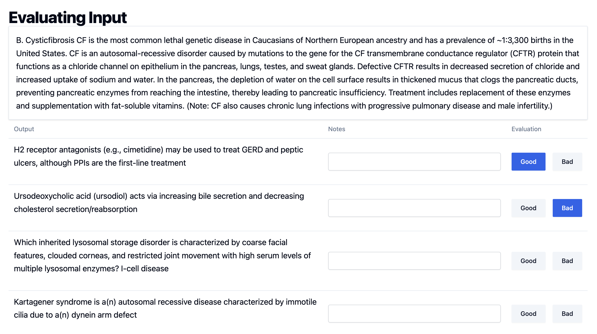

# ai-evals-workshop-materials

This is the companion repo that has shareable information used in Isaac Flath's annotation app in fasthtml workshop.

It contains everything covered in the talk + more.

The slides can be found [here](https://ai-evals-course.github.io/isaac-fasthtml-workshop/presentation/talk.html)

## Why FastHTML?

I like it because it feels like the most python native web development framework with the least boilerplate.

But if you're happy with fastapi, flask, django, nextjs, etc. those are fine to use too!  

This talk shows a tool, but the tool you choose isn't actually the important thing.  But you've got to choose one, and this is the one I find makes me most productive in this use-case.

## Talk Material:

The talk can be found in `presentation/talk.html`.  Open it in any browser.

**Agenda**
1. Discuss the real world use case
2. Show the actual application
3. Brief "what is FastHTML"
4. Walk through and explain code of a minimal version (code available after the lecture)
5. Resources & Q&A

## Application

There are 2 application in this repository showing introductory simple annotation apps.

- `fasthtml_app/main_in_memory.py`: Best place to start to understand how things work in a simple example.  Supports only good/bad rating, stores ratings in a python dict, uses a csv file for the dataset, and lets you download the ratings in a json.  This is intended to be a way to learn incrementally, not be the ideal app.
- `fasthtml_app/main_sqlite.py`:  This is a full annotation app that uses a sqlite database.  While minimal it has the core features you need to get started and is an example of a great starting point for this use-case.  This includes both rating and annotating the results.

To run check out the [fasthtml app's readme](./fasthtml_app/README.md)

## Bonus App

There's a fastapi/react version in `fastapi_react_app` - check out the [fastapi/react app's readme](./fastapi_react_app/README.md) to run both the frontend and backend.

## Resources to Learn FastHTML

I can't teach you everything you need to know in an hour.  Here's some resources to help dive in more:

- [Introduction of fasthtml interactivity from the HTMX perspective](https://isaacflath.com/blog/blog_post?fpath=posts%2F2025-04-22-HTMXFoundationsForFasthtml.qmd)
- [A walkthrough of a couple simple fasthtml apps](https://isaacflath.com/blog/blog_post?fpath=posts%2F2025-03-27-FastHTML-Lesson1.ipynb)
- [Example Search and Annotation App](https://github.com/Isaac-Flath/search-starter-demo)
- [FastHTML Gallery](https://gallery.fastht.ml/) to see minimal examples of different functionality
- [FastHTML Docs](doc.fastht.ml)
- [MonsterUI Docs](https://monsterui.answer.ai/)

## Deployment

FastHTML apps are starlette apps (same foundation as FastAPI).  They can be deployed anywhere any regular web app can be deployed, because they are a regular web app.

The easiest places to deploy are:

- Modal: You got free credits for signing up for the course course so use them!
- Railway: Easy to deploy.  If you don't know what to use, use this.
- Check out [Answer AI's FastHTML Deploy repo](https://github.com/answerdotai/fh-deploy) for more options
